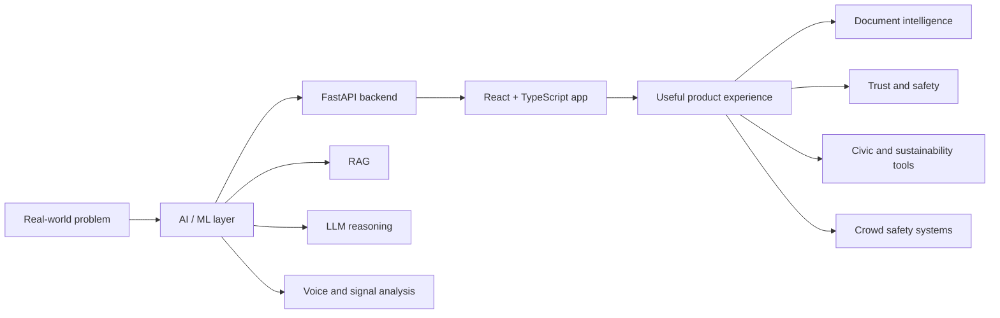

 

---

## About Me

I'm a Computer Science student specializing in **Artificial Intelligence and Machine Learning**. I like building practical systems that combine AI, backend engineering, product thinking, and real-world impact.

| Currently Exploring | Building With |
| --- | --- |
| RAG systems and document intelligence | TypeScript, React, FastAPI |
| Deep learning and model-backed APIs | Python, Firebase, Docker |
| AI products for real-world problems | LLM reasoning, streaming APIs, product workflows |

---

## Tech Stack

 
 

 

| Area | Tools & Technologies |
| --- | --- |
| AI / ML | Python, deep learning workflows, acoustic feature extraction, RAG, LLM reasoning |
| Backend | FastAPI, Python APIs, streaming responses, document processing, Docker |
| Frontend | TypeScript, JavaScript, React, HTML, CSS |
| Cloud / Product | Firebase, GitHub, deployment-ready full-stack apps |

---

## Featured Projects

<table>
  <tr>
    <td width="50%">
      <h3 align="center"><a href="https://github.com/NoorRattan/CROWDIQ">CROWDIQ</a></h3>
      
Real-time stadium crowd management with attendee navigation, queue monitoring, emergency routing, admin analytics, FastAPI, React, and Firebase.

      
<b>Solo / AI-Assisted Build</b>

    </td>
    <td width="50%">
      <h3 align="center"><a href="https://github.com/NoorRattan/AskMyPDF">AskMyPDF</a></h3>
      
AI-powered PDF chat with document upload, streamed answers, citations, React frontend, and FastAPI RAG backend.

      
<b>Solo / AI-Assisted Build</b>

    </td>
  </tr>
  <tr>
    <td width="50%">
      <h3 align="center"><a href="https://github.com/NoorRattan/Carbon-Footprint-Awareness-Platform">Carbon Footprint Awareness Platform</a></h3>
      
Full-stack carbon footprint tracker with activity logging, CO2e calculations, education content, goals, and personalized reduction insights.

      
<b>Solo / AI-Assisted Build</b>

    </td>
    <td width="50%">
      <h3 align="center"><a href="https://github.com/NoorRattan/election">Electra</a></h3>
      
Election education web app for first-time voters, students, and civic groups across the UK, USA, and India.

      
<b>Solo / AI-Assisted Build</b>

    </td>
  </tr>
  <tr>
    <td width="50%">
      <h3 align="center"><a href="https://github.com/NoorRattan/truthlens">TruthLens</a></h3>
      
Fake news and misinformation detection using LLM reasoning, source credibility checks, and real-time web corroboration.

      
<b>Collaborative Project</b>

    </td>
    <td width="50%">
      <h3 align="center"><a href="https://github.com/NoorRattan/AI-Voice-Detection">AI Voice Detection</a></h3>
      
Production-ready AI voice detection API with multi-language support and acoustic feature extraction.

      
<b>Collaborative Project</b>

    </td>
  </tr>
</table>

---

## Project Focus

| Area | What I Build |
| --- | --- |
| AI Applications | LLM apps, RAG systems, misinformation detection, document chat |
| Machine Learning | Deep learning workflows, voice detection, model-backed APIs |
| Full Stack | TypeScript/React frontends, FastAPI backends, Firebase-powered products |
| Real-World Impact | Sustainability tools, civic education apps, crowd safety systems |

---

## GitHub Activity

---

## What I Like Building

| Direction | What It Means |
| --- | --- |
| AI products with real users | Apps where AI is part of the workflow, not just a feature added on top |
| Document and knowledge systems | RAG apps, PDF chat, citation-backed answers, and useful search experiences |
| Trust and safety tools | Fake-news detection, source checking, AI voice detection, and credibility analysis |
| Public-impact platforms | Civic education, sustainability tracking, crowd safety, and decision-support tools |
| Full-stack AI systems | React interfaces connected to FastAPI backends, databases, cloud services, and model APIs |

---

### Let's build something useful with AI.

