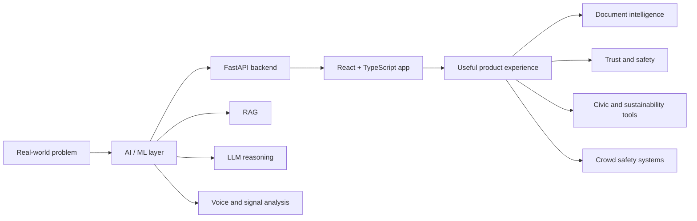

# Hi, I'm Noor Rattan

### AI & Machine Learning Student | AI-Assisted Full-Stack Builder | Problem Solver

---

## About Me

I'm a Computer Science student specializing in **Artificial Intelligence and Machine Learning**.  
I like building practical systems that combine AI, backend engineering, product thinking, and real-world impact.

Currently focused on:

- AI-powered web applications built with AI-assisted development
- RAG systems and document intelligence
- Deep learning and model-backed APIs
- Full-stack development with TypeScript, React, FastAPI, Firebase, and Python
- Building projects that solve real problems

---

## Tech Stack

| Area | Tools & Technologies |
| --- | --- |
| AI / ML | Python, deep learning workflows, acoustic feature extraction, RAG, LLM reasoning |
| Backend | FastAPI, Python APIs, streaming responses, document processing, Docker |
| Frontend | TypeScript, JavaScript, React, HTML, CSS |
| Cloud / Product | Firebase, GitHub, deployment-ready full-stack apps |

---

## Featured Projects

### Solo / AI-Assisted Builds

### [CROWDIQ](https://github.com/NoorRattan/CROWDIQ)

Real-time stadium crowd management platform with attendee navigation, queue monitoring, emergency routing, admin analytics, and FastAPI/React/Firebase architecture.

### [AskMyPDF](https://github.com/NoorRattan/AskMyPDF)

AI-powered PDF chat app with document upload, streamed answers, citations, React frontend, and FastAPI RAG backend.

### [Carbon Footprint Awareness Platform](https://github.com/NoorRattan/Carbon-Footprint-Awareness-Platform)

Full-stack carbon footprint tracker with activity logging, CO2e calculations, education content, goals, and personalized reduction insights.

### [Electra](https://github.com/NoorRattan/election)

Election education web app for first-time voters, students, and civic groups across the UK, USA, and India.

### Collaborative Projects

### [TruthLens](https://github.com/NoorRattan/truthlens)

AI-powered fake news and misinformation detection platform using LLM reasoning, source credibility checks, and real-time web corroboration. Built as a collaborative project.

### [AI Voice Detection](https://github.com/NoorRattan/AI-Voice-Detection)

Production-ready AI voice detection API with multi-language support and acoustic feature extraction. Built as a collaborative project.

---

## Project Focus

| Area | What I Build |
| --- | --- |
| AI Applications | LLM apps, RAG systems, misinformation detection, document chat |
| Machine Learning | Deep learning workflows, voice detection, model-backed APIs |
| Full Stack | TypeScript/React frontends, FastAPI backends, Firebase-powered products |
| Real-World Impact | Sustainability tools, civic education apps, crowd safety systems |

---

## GitHub Activity

---

## What I Like Building

| Direction | What It Means |
| --- | --- |
| AI products with real users | Apps where AI is part of the workflow, not just a feature added on top |
| Document and knowledge systems | RAG apps, PDF chat, citation-backed answers, and useful search experiences |
| Trust and safety tools | Fake-news detection, source checking, AI voice detection, and credibility analysis |
| Public-impact platforms | Civic education, sustainability tracking, crowd safety, and decision-support tools |
| Full-stack AI systems | React interfaces connected to FastAPI backends, databases, cloud services, and model APIs |

---

### Let's build something useful with AI.

